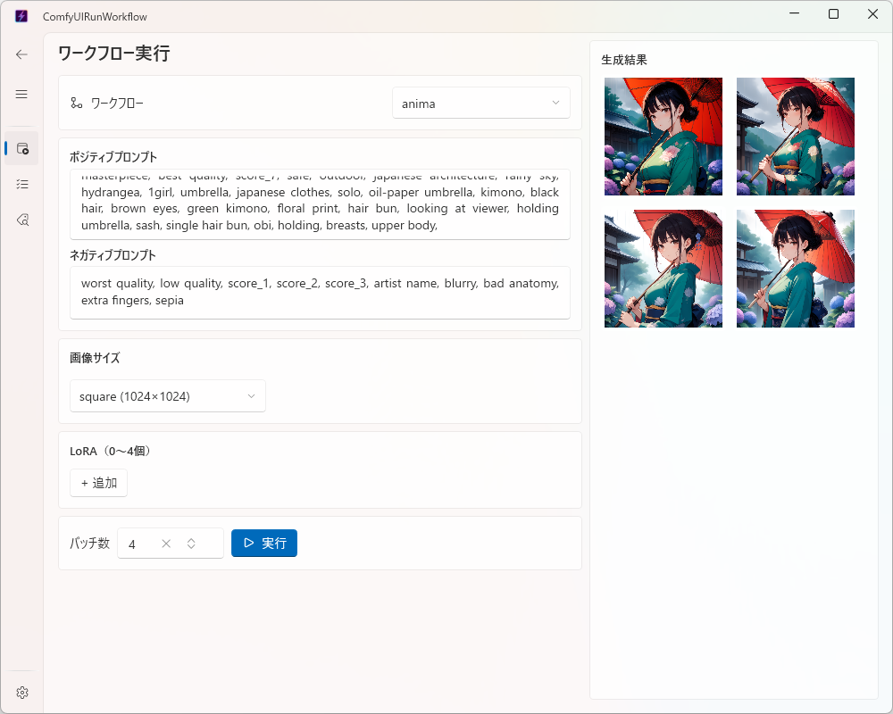
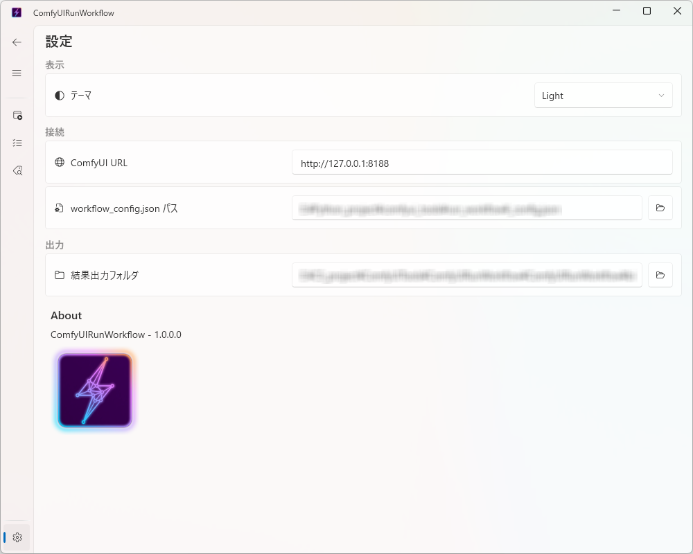

# ComfyUIRunWorkflow

✨ [English](doc/README_english.md)

ComfyUI のワークフローを GUI から実行するツール。[comfyui_tools](https://github.com/satoru634/comfyui_tools) の C# WPF 移植版。



## 機能

- ワークフロー実行（プロンプト・LoRA・画像サイズを GUI で指定）
- バッチ数指定（1〜10、実行ボタン左のバッチ数欄で指定した回数だけ連続実行）
- 実行結果の一覧表示と詳細確認
- 生成画像のプレビュー表示（実行直後・一覧・詳細ダイアログ、クリックで拡大表示）
- WD14 Tagger による画像タグ付け（画像を選択してタグ文字列を取得・コピー）
- Data ページでのタグ付け履歴表示（生成結果とタブで切り替え）
- テーマ切り替え・接続設定の永続化
- 日本語/英語の表示言語切替（設定ページ、再起動不要で即時反映）

## クイックスタート

### 必要環境

- Windows 10/11
- [.NET 8 SDK](https://dotnet.microsoft.com/download/dotnet/8.0) （Visual Studio 2022以上）
- 起動済みの [ComfyUI](https://github.com/comfyanonymous/ComfyUI) サーバー

※本プロジェクト同梱のワークフローテンプレートが使用する、以下のカスタムノード（ComfyUI 側に事前インストールが必要です）

- [ComfyUI-Impact-Pack](https://github.com/ltdrdata/ComfyUI-Impact-Pack)
- [ComfyUI-Impact-Subpack](https://github.com/ltdrdata/ComfyUI-Impact-Subpack)
- [ComfyUI-WD-Timm-Tagger](https://github.com/bedovyy/ComfyUI-WD-Timm-Tagger)

### ビルド・起動

```bash
git clone --recursive https://github.com/satoru634/ComfyUIRunWorkflow.git
cd ComfyUIRunWorkflow
dotnet run --project ComfyUIRunWorkflow
```

### 初回設定

1. **設定** ページを開きます
2. **ComfyUI URL**（デフォルト: `http://127.0.0.1:8188`）・**workflow_config.json パス**・**結果出力フォルダ** を設定します

リポジトリ直下にサンプルの [`workflow_config.json`](workflow_config.json) を配置しています。LoRA のファイル名など環境に合わせて内容を編集のうえ、**workflow_config.json パス** にこのファイルを指定してください。



### ワークフローを実行してみる

1. **Home** ページでワークフロー・プロンプト・画像サイズを選択します
2. **実行** ボタンをクリックします
3. **Data** ページで結果とプレビュー画像を確認します

各ページの詳しい使い方（LoRA・バッチ数・WD14 Tagger・タグ付け履歴タブなど）は [doc/usage.md](doc/usage.md) を参照してください。

## 技術スタック

| 項目 | 内容 |
|---|---|
| ランタイム | .NET 8 / WPF |
| UI フレームワーク | Wpf.Ui v4.3.0 |
| MVVM | CommunityToolkit.Mvvm v8.4.2 |
| DI | Microsoft.Extensions.Hosting |
| 共有ライブラリ | ComfyUILibs（サブモジュール） |

## プロジェクト構成

```
ComfyUIRunWorkflow/   ← ソリューションルート
  ComfyUILibs/        ← 共有ライブラリ（サブモジュール）
  ComfyUILibsTests/   ← ComfyUILibs テスト（162件）
  ComfyUIRunWorkflow/ ← WPF GUI プロジェクト
  ComfyUIRunWorkflowTests/ ← GUI テスト（173件）
  doc/                ← ドキュメント（使い方・英語版・クラス図）
```

## ドキュメント

- [使い方（詳細）](doc/usage.md)
- [クラス図](doc/class_diagram.md)

## ライセンス

[LICENSE](LICENSE) を参照してください。
