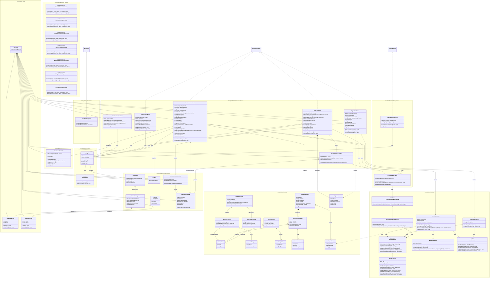
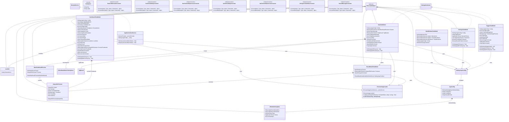
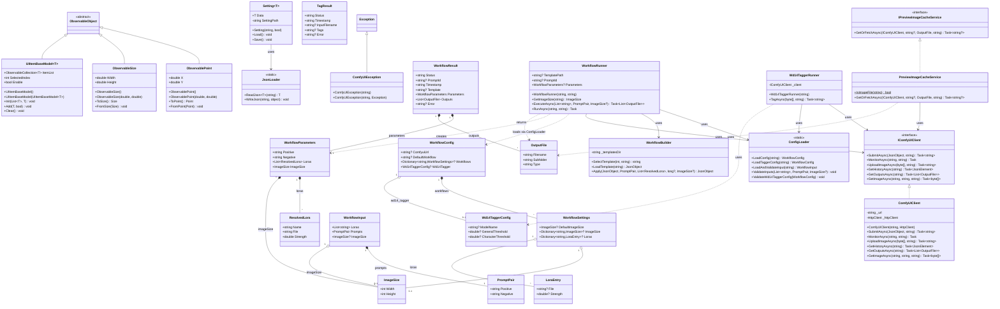

# クラス図

## 全体構造

```mermaid
classDiagram
    direction TB

    %% ===== ComfyUILibs / Base =====

    namespace ComfyUILibs_Base {
        class ObservableObject_lib {
            <<abstract>>
        }
        class ObservablePoint {
            +double X
            +double Y
            +ToPoint() Point
            +FromPoint(Point) void
        }
        class ObservableSize {
            +double Width
            +double Height
            +ToSize() Size
            +FromSize(Size) void
        }
    }

    %% ===== ComfyUILibs / Ui =====

    namespace ComfyUILibs_Ui {
        class UIItemBaseModel~T~ {
            +ObservableCollection~T~ ItemList
            +int SelectedIndex
            +bool Enable
            +UIItemBaseModel()
            +UIItemBaseModel(UIItemBaseModel~T~)
            +Init(List~T~, T) void
            +Add(T, bool) void
            +Clear() void
        }
    }

    %% ===== ComfyUILibs / Common =====

    namespace ComfyUILibs_Common {
        class JsonLoader {
            <<static>>
            +ReadJson~T~(string) T
            +WriteJson(string, object) void
        }
        class Setting~T~ {
            +T Data
            -string SettingPath
            +Setting(string, bool)
            +Load() void
            +Save() void
        }
    }

    %% ===== ComfyUILibs / Exceptions =====

    namespace ComfyUILibs_Exceptions {
        class ComfyUIException {
            +ComfyUIException(string)
            +ComfyUIException(string, Exception)
        }
    }

    %% ===== ComfyUILibs / Models =====

    namespace ComfyUILibs_Models {
        class ImageSize {
            +int Width
            +int Height
        }
        class LoraEntry {
            +string? File
            +double? Strength
        }
        class WorkflowSettings {
            +ImageSize? DefaultImageSize
            +Dictionary~string,ImageSize~? ImageSize
            +Dictionary~string,LoraEntry~? Loras
        }
        class Wd14TaggerConfig {
            +string? ModelName
            +double? GeneralThreshold
            +double? CharacterThreshold
        }
        class WorkflowConfig {
            +string? ComfyuiUrl
            +string? DefaultWorkflow
            +Dictionary~string,WorkflowSettings~? Workflows
            +Wd14TaggerConfig? Wd14Tagger
        }
        class PromptPair {
            +string Positive
            +string Negative
        }
        class WorkflowInput {
            +List~string~ Loras
            +PromptPair Prompts
            +ImageSize? ImageSize
        }
        class ResolvedLora {
            +string Name
            +string File
            +double Strength
        }
        class OutputFile {
            +string Filename
            +string Subfolder
            +string Type
        }
        class WorkflowParameters {
            +string Positive
            +string Negative
            +List~ResolvedLora~ Loras
            +ImageSize ImageSize
        }
        class WorkflowResult {
            +string Status
            +string? PromptId
            +string Timestamp
            +string? Template
            +WorkflowParameters Parameters
            +List~OutputFile~ Outputs
            +string? Error
        }
        class TagResult {
            +string Status
            +string Timestamp
            +string? InputFilename
            +string? Tags
            +string? Error
        }
    }

    %% ===== ComfyUILibs / Services =====

    namespace ComfyUILibs_Services {
        class IComfyUIClient {
            <<interface>>
            +SubmitAsync(JsonObject, string) Task~string~
            +MonitorAsync(string, string) Task
            +UploadImageAsync(byte[], string) Task~string~
            +GetHistoryAsync(string) Task~JsonElement~
            +GetOutputsAsync(string) Task~List~OutputFile~~
            +GetImageAsync(string, string, string) Task~byte[]~
        }
        class ComfyUIClient {
            -string _url
            -HttpClient _httpClient
            +ComfyUIClient(string, HttpClient)
            +SubmitAsync(JsonObject, string) Task~string~
            +MonitorAsync(string, string) Task
            +UploadImageAsync(byte[], string) Task~string~
            +GetHistoryAsync(string) Task~JsonElement~
            +GetOutputsAsync(string) Task~List~OutputFile~~
            +GetImageAsync(string, string, string) Task~byte[]~
        }
        class WorkflowBuilder {
            -string _templatesDir
            +SelectTemplate(int, string) string
            +LoadTemplate(string) JsonObject
            +Apply(JsonObject, PromptPair, List~ResolvedLora~, long?, ImageSize?) JsonObject
        }
        class WorkflowRunner {
            +string? TemplatePath
            +string? PromptId
            +WorkflowParameters? Parameters
            +WorkflowRunner(string, string)
            +GetImageSize(string) ImageSize
            +ExecuteAsync(List~string~, PromptPair, ImageSize?) Task~List~OutputFile~~
            +RunAsync(string, string) Task
        }
        class ConfigLoader {
            <<static>>
            +LoadConfig(string) WorkflowConfig
            +LoadTaggerConfig(string) WorkflowConfig
            +LoadAndValidateInput(string) WorkflowInput
            +ValidateInputs(List~string~, PromptPair, ImageSize?) void
            +ValidateWd14TaggerConfig(WorkflowConfig) void
        }
        class Wd14TaggerRunner {
            -IComfyUIClient _client
            +Wd14TaggerRunner(string)
            +TagAsync(byte[], string) Task~string~
        }
        class IPreviewImageCacheService {
            <<interface>>
            +GetOrFetchAsync(IComfyUIClient, string?, OutputFile, string) Task~string?~
        }
        class PreviewImageCacheService {
            +IsImageFile(string) bool$
            +GetOrFetchAsync(IComfyUIClient, string?, OutputFile, string) Task~string?~
        }
    }

    %% ===== ComfyUIRunWorkflow / Models =====

    namespace ComfyUIRunWorkflow_Models {
        class WindowSettingData {
            +ObservablePoint WindowPos
            +ObservableSize WindowSize
            +WindowState State
            +ApplicationTheme Theme
            +bool IsPaneOpen
        }
        class AppConfig {
            +WindowSettingData WindowSetting
            +string ComfyUIUrl
            +string ConfigPath
            +string ResultsFolder
        }
        class LoraSlot {
            +string SelectedLora
        }
        class SizeOption {
            <<record>>
            +string Key
            +string Label
        }
        class OutputFilePreview {
            +OutputFile Output
            +bool IsImage
            +string? CachedFilePath
            +BitmapImage? Thumbnail
            +bool IsLoading
            +bool HasError
            +OutputFilePreview(OutputFile)
        }
        class WorkflowResultPreview {
            +WorkflowResult Result
            +OutputFilePreview? Preview
            +WorkflowResultPreview(WorkflowResult)
        }
    }

    %% ===== ComfyUIRunWorkflow / ViewModels =====

    namespace ComfyUIRunWorkflow_ViewModels {
        class MainWindowViewModel {
            +string ApplicationTitle
            +ObservableCollection~object~ MenuItems
            +ObservableCollection~object~ FooterMenuItems
            +ObservableCollection~MenuItem~ TrayMenuItems
            +Setting~AppConfig~ Config
            +WindowClosingCommand
        }
        class DashboardViewModel {
            +Setting~AppConfig~ Config
            +List~string~ WorkflowNames
            +string SelectedWorkflow
            +List~string~ AvailableLoras
            +bool IsConfigLoaded
            +UIItemBaseModel~SizeOption~ SizeLabelList
            +string PositivePrompt
            +string NegativePrompt
            +string ImageSizeOrientation
            +bool IsCustomSize
            +int CustomWidth
            +int CustomHeight
            +string SelectedSizeOption
            +ObservableCollection~LoraSlot~ LoraSlots
            +bool IsRunning
            +int BatchCount
            +string BatchProgressText
            +ObservableCollection~OutputFilePreview~ PreviewThumbnails
            +bool HasPreviewThumbnails
            +RunWorkflowCommand
            +AddLoraCommand
            +RemoveLoraCommand
            +OnNavigatedToAsync() Task
            +OnNavigatedFromAsync() Task
        }
        class SettingsViewModel {
            +Setting~AppConfig~ Config
            +string AppVersion
            +ApplicationTheme SelectedTheme
            +List~ApplicationTheme~ ThemeList
            +BrowseConfigPathCommand
            +BrowseResultsFolderCommand
            +OnNavigatedToAsync() Task
            +OnNavigatedFromAsync() Task
        }
        class DataViewModel {
            +Setting~AppConfig~ Config
            +ObservableCollection~WorkflowResultPreview~ Results
            +string StatusMessage
            +ObservableCollection~TagResult~ TagResults
            +string TagStatusMessage
            +bool IsTagHistorySelected
            +bool IsLoading
            +RefreshCommand
            +ShowResultsTabCommand
            +ShowTagHistoryTabCommand
            +OpenDetailCommand
            +CopyTagsCommand
            +OnNavigatedToAsync() Task
            +OnNavigatedFromAsync() Task
        }
        class TaggerViewModel {
            +Setting~AppConfig~ Config
            +bool IsConfigLoaded
            +string? SelectedImagePath
            +BitmapImage? SelectedImagePreview
            +bool IsRunning
            +string ResultTags
            +bool HasResult
            +BrowseImageCommand
            +SetSelectedImage(string) void
            +TagImageCommand
            +CopyTagsCommand
            +OnNavigatedToAsync() Task
            +OnNavigatedFromAsync() Task
        }
        class ResultDetailViewModel {
            +WorkflowResult Result
            +ObservableCollection~OutputFilePreview~ Previews
            +ResultDetailViewModel(WorkflowResult, Setting~AppConfig~)
            +OpenEnlargedCommand
        }
    }

    %% ===== ComfyUIRunWorkflow / Services =====

    namespace ComfyUIRunWorkflow_Services {
        class ApplicationHostService {
            -IServiceProvider _serviceProvider
            -Setting~AppConfig~ _config
            +StartAsync(CancellationToken) Task
            +StopAsync(CancellationToken) Task
        }
        class PreviewImageLoader {
            -IPreviewImageCacheService _cacheService
            +PreviewImageLoader()
            +LoadAsync(OutputFilePreview, IComfyUIClient, string?, string) Task
            +LoadFullSize(string) BitmapImage$
        }
    }

    %% ===== ComfyUIRunWorkflow / Helpers =====

    namespace ComfyUIRunWorkflow_Helpers {
        class EnumToBooleanConverter {
            <<IValueConverter>>
            +Convert(object, Type, object, CultureInfo) object
            +ConvertBack(object, Type, object, CultureInfo) object
        }
        class BoolToVisibilityConverter {
            <<IValueConverter>>
            +Convert(object, Type, object, CultureInfo) object
            +ConvertBack(object, Type, object, CultureInfo) object
        }
        class BoolToVisibilityInverseConverter {
            <<IValueConverter>>
            +Convert(object, Type, object, CultureInfo) object
            +ConvertBack(object, Type, object, CultureInfo) object
        }
        class NullToVisibilityConverter {
            <<IValueConverter>>
            +Convert(object, Type, object, CultureInfo) object
            +ConvertBack(object, Type, object, CultureInfo) object
        }
        class NullToVisibilityInverseConverter {
            <<IValueConverter>>
            +Convert(object, Type, object, CultureInfo) object
            +ConvertBack(object, Type, object, CultureInfo) object
        }
        class FileTypeToVisibilityConverter {
            <<IValueConverter>>
            +Convert(object, Type, object, CultureInfo) object
            +ConvertBack(object, Type, object, CultureInfo) object
        }
        class ResultMessageConverter {
            <<IValueConverter>>
            +Convert(object, Type, object, CultureInfo) object
            +ConvertBack(object, Type, object, CultureInfo) object
        }
    }

    %% ===== 継承・実装 =====

    ObservableObject_lib <|-- ObservablePoint
    ObservableObject_lib <|-- ObservableSize
    ObservableObject_lib <|-- UIItemBaseModel~T~
    Exception <|-- ComfyUIException
    IComfyUIClient <|.. ComfyUIClient
    IPreviewImageCacheService <|.. PreviewImageCacheService
    ObservableObject_lib <|-- WindowSettingData
    ObservableObject_lib <|-- AppConfig
    ObservableObject_lib <|-- LoraSlot
    ObservableObject_lib <|-- OutputFilePreview
    ObservableObject_lib <|-- WorkflowResultPreview
    ObservableObject_lib <|-- MainWindowViewModel
    ObservableObject_lib <|-- DashboardViewModel
    ObservableObject_lib <|-- SettingsViewModel
    ObservableObject_lib <|-- DataViewModel
    ObservableObject_lib <|-- TaggerViewModel
    ObservableObject_lib <|-- ResultDetailViewModel
    INavigationAware <|.. DashboardViewModel
    INavigationAware <|.. SettingsViewModel
    INavigationAware <|.. DataViewModel
    INavigationAware <|.. TaggerViewModel
    IHostedService <|.. ApplicationHostService

    %% ===== 関連・依存 =====

    Setting~T~ --> JsonLoader : uses
    WorkflowConfig "1" *-- "*" WorkflowSettings : workflows
    WorkflowConfig "1" o-- "0..1" Wd14TaggerConfig : wd14_tagger
    WorkflowSettings "1" o-- "0..1" ImageSize : defaultImageSize
    WorkflowSettings "1" o-- "*" LoraEntry : loras
    WorkflowParameters "1" *-- "*" ResolvedLora : loras
    WorkflowParameters "1" *-- "1" ImageSize : imageSize
    WorkflowResult "1" *-- "1" WorkflowParameters : parameters
    WorkflowResult "1" *-- "*" OutputFile : outputs
    WorkflowInput "1" *-- "1" PromptPair : prompts
    WorkflowInput "1" o-- "0..1" ImageSize : imageSize
    WorkflowRunner --> ConfigLoader : uses
    WorkflowRunner --> WorkflowBuilder : uses
    WorkflowRunner --> IComfyUIClient : uses
    Wd14TaggerRunner --> IComfyUIClient : uses
    Wd14TaggerRunner --> ConfigLoader : uses
    PreviewImageCacheService --> IComfyUIClient : uses
    PreviewImageCacheService ..> OutputFile : uses

    AppConfig "1" *-- "1" WindowSettingData : windowSetting
    WindowSettingData "1" *-- "1" ObservablePoint : windowPos
    WindowSettingData "1" *-- "1" ObservableSize : windowSize
    WorkflowResultPreview "1" o-- "0..1" OutputFilePreview : preview

    MainWindowViewModel --> Setting~AppConfig~ : uses
    DashboardViewModel --> Setting~AppConfig~ : uses
    DashboardViewModel "1" o-- "*" LoraSlot : loraSlots
    DashboardViewModel "1" o-- "1" UIItemBaseModel~SizeOption~ : sizeLabelList
    DashboardViewModel "1" *-- "*" OutputFilePreview : previewThumbnails
    DashboardViewModel --> WorkflowRunner : creates
    DashboardViewModel --> WorkflowResult : creates
    DashboardViewModel --> PreviewImageLoader : uses
    SettingsViewModel --> Setting~AppConfig~ : uses
    DataViewModel --> Setting~AppConfig~ : uses
    DataViewModel "1" *-- "*" WorkflowResultPreview : results
    DataViewModel "1" *-- "*" TagResult : tagResults
    DataViewModel --> PreviewImageLoader : uses
    DataViewModel --> ResultDetailViewModel : opens
    TaggerViewModel --> Setting~AppConfig~ : uses
    TaggerViewModel --> Wd14TaggerRunner : creates
    TaggerViewModel ..> TagResult : creates
    ResultDetailViewModel "1" *-- "*" OutputFilePreview : previews
    ResultDetailViewModel --> PreviewImageLoader : uses
    PreviewImageLoader --> IPreviewImageCacheService : uses
    ApplicationHostService --> Setting~AppConfig~ : uses
    Setting~AppConfig~ --> AppConfig : manages
```

---

## ComfyUIRunWorkflow 詳細図

```mermaid
classDiagram
    direction TB

    class ObservableObject {
        <<abstract>>
    }

    %% ----- Models -----

    class WindowSettingData {
        +ObservablePoint WindowPos
        +ObservableSize WindowSize
        +WindowState State
        +ApplicationTheme Theme
        +bool IsPaneOpen
    }

    class AppConfig {
        +WindowSettingData WindowSetting
        +string ComfyUIUrl
        +string ConfigPath
        +string ResultsFolder
    }

    class LoraSlot {
        +string SelectedLora
    }

    class SizeOption {
        <<record>>
        +string Key
        +string Label
    }

    class OutputFilePreview {
        +OutputFile Output
        +bool IsImage
        +string? CachedFilePath
        +BitmapImage? Thumbnail
        +bool IsLoading
        +bool HasError
        +OutputFilePreview(OutputFile)
    }

    class WorkflowResultPreview {
        +WorkflowResult Result
        +OutputFilePreview? Preview
        +WorkflowResultPreview(WorkflowResult)
    }

    %% ----- ViewModels -----

    class MainWindowViewModel {
        +string ApplicationTitle
        +ObservableCollection~object~ MenuItems
        +ObservableCollection~object~ FooterMenuItems
        +ObservableCollection~MenuItem~ TrayMenuItems
        +Setting~AppConfig~ Config
        +WindowClosingCommand
    }

    class DashboardViewModel {
        +Setting~AppConfig~ Config
        +List~string~ WorkflowNames
        +string SelectedWorkflow
        +List~string~ AvailableLoras
        +bool IsConfigLoaded
        +UIItemBaseModel~SizeOption~ SizeLabelList
        +string PositivePrompt
        +string NegativePrompt
        +string ImageSizeOrientation
        +bool IsCustomSize
        +int CustomWidth
        +int CustomHeight
        +string SelectedSizeOption
        +ObservableCollection~LoraSlot~ LoraSlots
        +bool IsRunning
        +int BatchCount
        +string BatchProgressText
        +ObservableCollection~OutputFilePreview~ PreviewThumbnails
        +bool HasPreviewThumbnails
        +RunWorkflowCommand
        +AddLoraCommand
        +RemoveLoraCommand
        +OnNavigatedToAsync() Task
        +OnNavigatedFromAsync() Task
    }

    class SettingsViewModel {
        +Setting~AppConfig~ Config
        +string AppVersion
        +ApplicationTheme SelectedTheme
        +List~ApplicationTheme~ ThemeList
        +BrowseConfigPathCommand
        +BrowseResultsFolderCommand
        +OnNavigatedToAsync() Task
        +OnNavigatedFromAsync() Task
    }

    class DataViewModel {
        +Setting~AppConfig~ Config
        +ObservableCollection~WorkflowResultPreview~ Results
        +string StatusMessage
        +ObservableCollection~TagResult~ TagResults
        +string TagStatusMessage
        +bool IsTagHistorySelected
        +bool IsLoading
        +RefreshCommand
        +ShowResultsTabCommand
        +ShowTagHistoryTabCommand
        +OpenDetailCommand
        +CopyTagsCommand
        +OnNavigatedToAsync() Task
        +OnNavigatedFromAsync() Task
    }

    class TaggerViewModel {
        +Setting~AppConfig~ Config
        +bool IsConfigLoaded
        +string? SelectedImagePath
        +BitmapImage? SelectedImagePreview
        +bool IsRunning
        +string ResultTags
        +bool HasResult
        +BrowseImageCommand
        +SetSelectedImage(string) void
        +TagImageCommand
        +CopyTagsCommand
        +OnNavigatedToAsync() Task
        +OnNavigatedFromAsync() Task
    }

    class ResultDetailViewModel {
        +WorkflowResult Result
        +ObservableCollection~OutputFilePreview~ Previews
        +ResultDetailViewModel(WorkflowResult, Setting~AppConfig~)
        +OpenEnlargedCommand
    }

    %% ----- Services -----

    class ApplicationHostService {
        -IServiceProvider _serviceProvider
        -Setting~AppConfig~ _config
        +StartAsync(CancellationToken) Task
        +StopAsync(CancellationToken) Task
    }

    class PreviewImageLoader {
        -IPreviewImageCacheService _cacheService
        +PreviewImageLoader()
        +LoadAsync(OutputFilePreview, IComfyUIClient, string?, string) Task
        +LoadFullSize(string) BitmapImage$
    }

    %% ----- Helpers -----

    class EnumToBooleanConverter {
        <<IValueConverter>>
        +Convert(object, Type, object, CultureInfo) object
        +ConvertBack(object, Type, object, CultureInfo) object
    }

    class BoolToVisibilityConverter {
        <<IValueConverter>>
        +Convert(object, Type, object, CultureInfo) object
        +ConvertBack(object, Type, object, CultureInfo) object
    }

    class BoolToVisibilityInverseConverter {
        <<IValueConverter>>
        +Convert(object, Type, object, CultureInfo) object
        +ConvertBack(object, Type, object, CultureInfo) object
    }

    class NullToVisibilityConverter {
        <<IValueConverter>>
        +Convert(object, Type, object, CultureInfo) object
        +ConvertBack(object, Type, object, CultureInfo) object
    }

    class NullToVisibilityInverseConverter {
        <<IValueConverter>>
        +Convert(object, Type, object, CultureInfo) object
        +ConvertBack(object, Type, object, CultureInfo) object
    }

    class FileTypeToVisibilityConverter {
        <<IValueConverter>>
        +Convert(object, Type, object, CultureInfo) object
        +ConvertBack(object, Type, object, CultureInfo) object
    }

    class ResultMessageConverter {
        <<IValueConverter>>
        +Convert(object, Type, object, CultureInfo) object
        +ConvertBack(object, Type, object, CultureInfo) object
    }

    %% ----- 継承・実装 -----

    ObservableObject <|-- WindowSettingData
    ObservableObject <|-- AppConfig
    ObservableObject <|-- LoraSlot
    ObservableObject <|-- OutputFilePreview
    ObservableObject <|-- WorkflowResultPreview
    ObservableObject <|-- MainWindowViewModel
    ObservableObject <|-- DashboardViewModel
    ObservableObject <|-- SettingsViewModel
    ObservableObject <|-- DataViewModel
    ObservableObject <|-- TaggerViewModel
    ObservableObject <|-- ResultDetailViewModel
    INavigationAware <|.. DashboardViewModel
    INavigationAware <|.. SettingsViewModel
    INavigationAware <|.. DataViewModel
    INavigationAware <|.. TaggerViewModel
    IHostedService <|.. ApplicationHostService

    %% ----- 関連 -----

    AppConfig "1" *-- "1" WindowSettingData : windowSetting
    WorkflowResultPreview "1" o-- "0..1" OutputFilePreview : preview
    MainWindowViewModel --> Setting~AppConfig~ : uses
    DashboardViewModel --> Setting~AppConfig~ : uses
    DashboardViewModel "1" o-- "*" LoraSlot : loraSlots
    DashboardViewModel "1" o-- "1" UIItemBaseModel~SizeOption~ : sizeLabelList
    DashboardViewModel "1" *-- "*" OutputFilePreview : previewThumbnails
    DashboardViewModel --> PreviewImageLoader : uses
    SettingsViewModel --> Setting~AppConfig~ : uses
    DataViewModel --> Setting~AppConfig~ : uses
    DataViewModel "1" *-- "*" WorkflowResultPreview : results
    DataViewModel "1" *-- "*" TagResult : tagResults
    DataViewModel --> PreviewImageLoader : uses
    DataViewModel --> ResultDetailViewModel : opens
    TaggerViewModel --> Setting~AppConfig~ : uses
    ResultDetailViewModel "1" *-- "*" OutputFilePreview : previews
    ResultDetailViewModel --> PreviewImageLoader : uses
    Setting~AppConfig~ --> AppConfig : manages
```

---

## ComfyUILibs 詳細図

```mermaid
classDiagram
    direction TB

    %% ----- Base -----

    class ObservableObject {
        <<abstract>>
    }

    class ObservablePoint {
        +double X
        +double Y
        +ObservablePoint()
        +ObservablePoint(double, double)
        +ToPoint() Point
        +FromPoint(Point) void
    }

    class ObservableSize {
        +double Width
        +double Height
        +ObservableSize()
        +ObservableSize(double, double)
        +ToSize() Size
        +FromSize(Size) void
    }

    %% ----- Ui -----

    class UIItemBaseModel~T~ {
        +ObservableCollection~T~ ItemList
        +int SelectedIndex
        +bool Enable
        +UIItemBaseModel()
        +UIItemBaseModel(UIItemBaseModel~T~)
        +Init(List~T~, T) void
        +Add(T, bool) void
        +Clear() void
    }

    %% ----- Common -----

    class JsonLoader {
        <<static>>
        +ReadJson~T~(string) T
        +WriteJson(string, object) void
    }

    class Setting~T~ {
        +T Data
        -string SettingPath
        +Setting(string, bool)
        +Load() void
        +Save() void
    }

    %% ----- Exceptions -----

    class ComfyUIException {
        +ComfyUIException(string)
        +ComfyUIException(string, Exception)
    }

    %% ----- Models -----

    class ImageSize {
        +int Width
        +int Height
    }

    class LoraEntry {
        +string? File
        +double? Strength
    }

    class WorkflowSettings {
        +ImageSize? DefaultImageSize
        +Dictionary~string,ImageSize~? ImageSize
        +Dictionary~string,LoraEntry~? Loras
    }

    class Wd14TaggerConfig {
        +string? ModelName
        +double? GeneralThreshold
        +double? CharacterThreshold
    }

    class WorkflowConfig {
        +string? ComfyuiUrl
        +string? DefaultWorkflow
        +Dictionary~string,WorkflowSettings~? Workflows
        +Wd14TaggerConfig? Wd14Tagger
    }

    class PromptPair {
        +string Positive
        +string Negative
    }

    class WorkflowInput {
        +List~string~ Loras
        +PromptPair Prompts
        +ImageSize? ImageSize
    }

    class ResolvedLora {
        +string Name
        +string File
        +double Strength
    }

    class OutputFile {
        +string Filename
        +string Subfolder
        +string Type
    }

    class WorkflowParameters {
        +string Positive
        +string Negative
        +List~ResolvedLora~ Loras
        +ImageSize ImageSize
    }

    class WorkflowResult {
        +string Status
        +string? PromptId
        +string Timestamp
        +string? Template
        +WorkflowParameters Parameters
        +List~OutputFile~ Outputs
        +string? Error
    }

    class TagResult {
        +string Status
        +string Timestamp
        +string? InputFilename
        +string? Tags
        +string? Error
    }

    %% ----- Services -----

    class IComfyUIClient {
        <<interface>>
        +SubmitAsync(JsonObject, string) Task~string~
        +MonitorAsync(string, string) Task
        +UploadImageAsync(byte[], string) Task~string~
        +GetHistoryAsync(string) Task~JsonElement~
        +GetOutputsAsync(string) Task~List~OutputFile~~
        +GetImageAsync(string, string, string) Task~byte[]~
    }

    class ComfyUIClient {
        -string _url
        -HttpClient _httpClient
        +ComfyUIClient(string, HttpClient)
        +SubmitAsync(JsonObject, string) Task~string~
        +MonitorAsync(string, string) Task
        +UploadImageAsync(byte[], string) Task~string~
        +GetHistoryAsync(string) Task~JsonElement~
        +GetOutputsAsync(string) Task~List~OutputFile~~
        +GetImageAsync(string, string, string) Task~byte[]~
    }

    class WorkflowBuilder {
        -string _templatesDir
        +SelectTemplate(int, string) string
        +LoadTemplate(string) JsonObject
        +Apply(JsonObject, PromptPair, List~ResolvedLora~, long?, ImageSize?) JsonObject
    }

    class WorkflowRunner {
        +string? TemplatePath
        +string? PromptId
        +WorkflowParameters? Parameters
        +WorkflowRunner(string, string)
        +GetImageSize(string) ImageSize
        +ExecuteAsync(List~string~, PromptPair, ImageSize?) Task~List~OutputFile~~
        +RunAsync(string, string) Task
    }

    class ConfigLoader {
        <<static>>
        +LoadConfig(string) WorkflowConfig
        +LoadTaggerConfig(string) WorkflowConfig
        +LoadAndValidateInput(string) WorkflowInput
        +ValidateInputs(List~string~, PromptPair, ImageSize?) void
        +ValidateWd14TaggerConfig(WorkflowConfig) void
    }

    class Wd14TaggerRunner {
        -IComfyUIClient _client
        +Wd14TaggerRunner(string)
        +TagAsync(byte[], string) Task~string~
    }

    class IPreviewImageCacheService {
        <<interface>>
        +GetOrFetchAsync(IComfyUIClient, string?, OutputFile, string) Task~string?~
    }

    class PreviewImageCacheService {
        +IsImageFile(string) bool$
        +GetOrFetchAsync(IComfyUIClient, string?, OutputFile, string) Task~string?~
    }

    %% ----- 継承・実装 -----

    ObservableObject <|-- ObservablePoint
    ObservableObject <|-- ObservableSize
    ObservableObject <|-- UIItemBaseModel~T~
    Exception <|-- ComfyUIException
    IComfyUIClient <|.. ComfyUIClient
    IPreviewImageCacheService <|.. PreviewImageCacheService

    %% ----- 関連 -----

    Setting~T~ --> JsonLoader : uses

    WorkflowConfig "1" *-- "*" WorkflowSettings : workflows
    WorkflowConfig "1" o-- "0..1" Wd14TaggerConfig : wd14_tagger
    WorkflowSettings "1" o-- "0..1" ImageSize : defaultImageSize
    WorkflowSettings "1" o-- "*" LoraEntry : loras

    WorkflowInput "1" *-- "1" PromptPair : prompts
    WorkflowInput "1" o-- "0..1" ImageSize : imageSize

    WorkflowParameters "1" *-- "*" ResolvedLora : loras
    WorkflowParameters "1" *-- "1" ImageSize : imageSize

    WorkflowResult "1" *-- "1" WorkflowParameters : parameters
    WorkflowResult "1" *-- "*" OutputFile : outputs

    WorkflowRunner --> ConfigLoader : uses
    WorkflowRunner --> WorkflowBuilder : uses
    WorkflowRunner --> IComfyUIClient : uses
    WorkflowRunner ..> WorkflowConfig : loads via ConfigLoader
    WorkflowRunner ..> WorkflowParameters : creates
    WorkflowRunner ..> OutputFile : returns

    Wd14TaggerRunner --> IComfyUIClient : uses
    Wd14TaggerRunner --> ConfigLoader : uses
    Wd14TaggerRunner ..> Wd14TaggerConfig : uses

    PreviewImageCacheService --> IComfyUIClient : uses
    PreviewImageCacheService ..> OutputFile : uses
```
