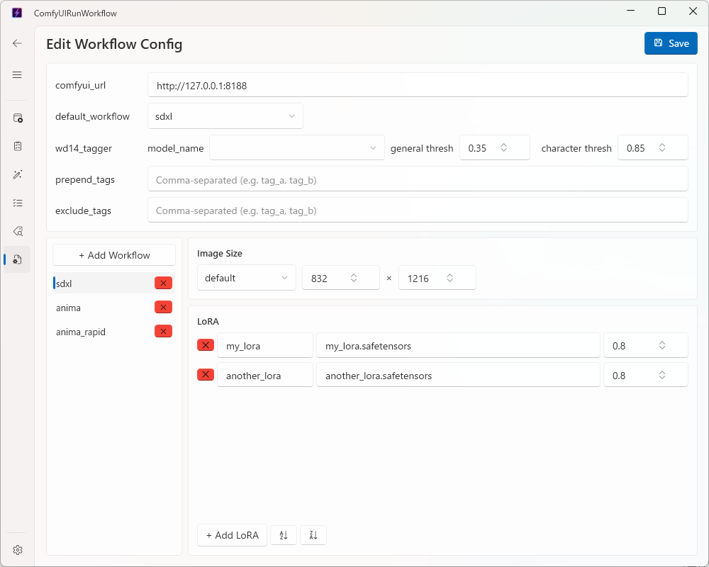

# Config Page (Editing Workflow Settings) (For Administrators)

✨ [日本語](config.md)

This page lets you edit `workflow_config.json` — the file that defines art styles (workflows) and LoRA settings — right from the app's screen, without needing a text editor.
This page is mainly intended for the administrator who sets up the app. If you're just generating images day to day, you don't need to use this page.

## Basic Usage

1. At the top of the screen, check and update the common settings ("comfyui_url", "default_workflow", etc.) as needed
2. From the workflow list on the left, select the workflow you want to edit
3. Edit the image size and LoRA fields shown on the right
4. Once you're done, click **Save** in the top-right corner

If you navigate to another page without saving, your edits are lost. Always click Save when you're finished editing.

## Adding and Removing Workflows

- Click **+ Add Workflow** in the top-left to add a new workflow — it's added and immediately ready for you to type in a name
- You can rename a workflow at any time by double-clicking its entry in the list
- Click the **×** button next to a workflow to delete it. However, a workflow currently set as "default_workflow" cannot be deleted

## Editing Image Size

The dropdown on the left of the "Image Size" section (default / vertical / horizontal / square) selects which kind you're editing; that kind's width and height then appear in the two fields to its right. Change the numbers, then switch to another kind to edit it — the previous kind's values are kept as you go. All four kinds are edited one at a time through this same row.

## Editing LoRA

In the "LoRA" section on the right side of the selected workflow, enter three values per LoRA entry: "logical name", "file name", and "strength". Click **+ Add LoRA** to add a row, and use the **×** button at the left edge of a row to remove it.

The two sort buttons next to **+ Add LoRA** reorder the list by LoRA name (logical name), ascending or descending — handy for finding a specific LoRA once the list gets long.

## About Validation on Save

Clicking Save automatically checks the content for mistakes. If an image size value looks wrong, or a LoRA logical name is blank or duplicated, an error is shown and nothing is saved. Check the error message, fix the input, and try saving again.

If a template file for image generation hasn't been prepared yet for a newly added workflow, you can still save, but a warning message will be shown. Before actually generating images with that workflow, check with your administrator that the template file is in place.

## Notes

- The model name in the "wd14_tagger" section is chosen from 5 preset choices (wd-vit-tagger-v3, etc.) in a dropdown
- Saving with the model name in the "wd14_tagger" section left blank disables the tagging feature ([Tagger page](tagger_english.md)) settings entirely
- "prepend_tags" and "exclude_tags" accept multiple tags separated by commas
