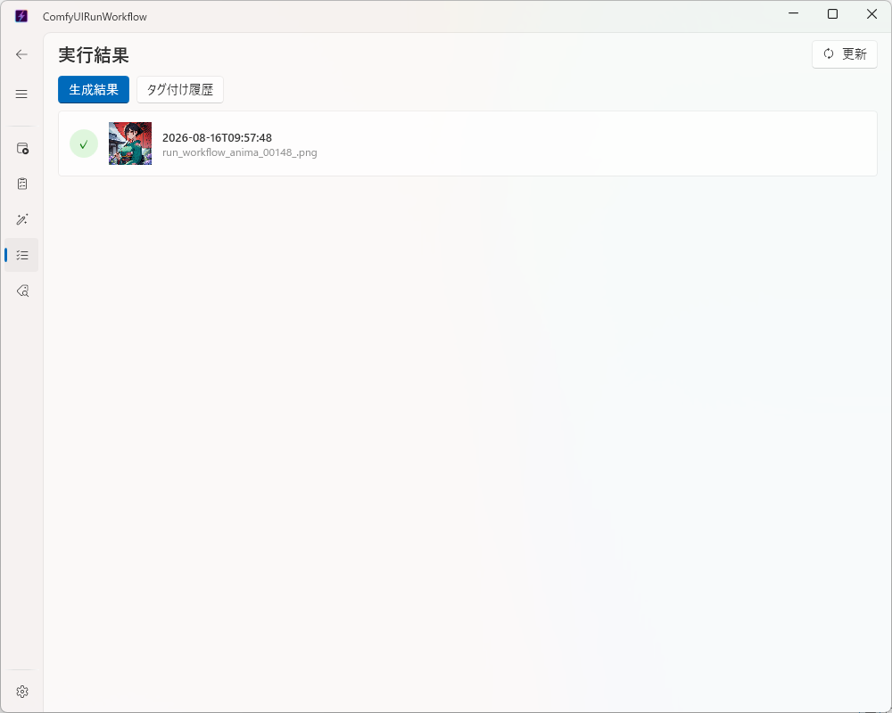

# Data ページ（生成した画像を確認する）

✨ [English](data_english.md)

これまでに生成した画像や、タグ付けした結果を一覧で確認できるページです。

## 生成結果タブ

- [Home ページ](home.md) や [Queue ページ](queue.md) で生成した画像が、新しいものから順に一覧表示されます。
- 一覧の行をクリックすると、その回に生成された画像をまとめて確認できます。
- 画像（サムネイル）をクリックすると、大きく表示されます。

## タグ付け履歴タブ

- [Tagger ページ](tagger.md) で画像にタグを付けた結果が、新しいものから順に一覧表示されます。
- 各カードにある **コピー** ボタンで、タグの文字列をコピーできます。

## 一覧を最新の状態にする

右上の **更新** ボタンをクリックすると、両方のタブの一覧を最新の状態に読み込み直します。
