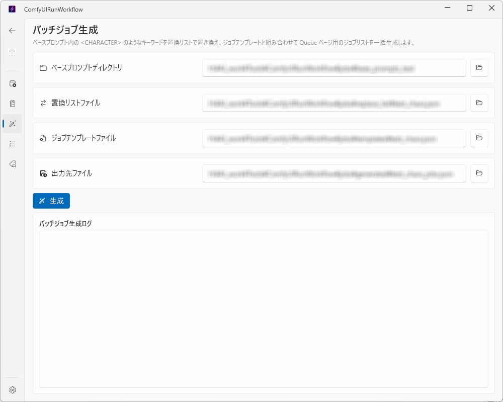

# Generate ページ（大量の生成予約を一気に作る）

✨ [English](generate_english.md)

キャラクターや衣装だけを変えて、同じ構図の画像をたくさん作りたいときに使うページです。
[Queue ページ](queue.md) に1件ずつジョブを手作業で登録する代わりに、まとめて自動生成できます。

このページは他のページと違い、あらかじめいくつかの「テキストファイル」を用意する必要があります。少し手間がかかりますが、アプリに付属しているサンプルファイルをコピーして書き換えるだけで使えます。

## 使う前の準備（サンプルファイルを利用する方法）

アプリと同じ場所に `sample_jobs` というフォルダがあります。この中のファイルをコピーして書き換えることで、必要なファイルを簡単に用意できます。

| フォルダ | 役割 |
|---|---|
| `sample_jobs/base_prompts/` | 生成したい構図・シーンごとに1つずつ用意するファイル。`<character>` のような `< >` で囲まれた部分が、後で指定する文字に置き換わります |
| `sample_jobs/replace_list/` | `<character>` などの目印を、実際にどんな文字に置き換えるかを指定するファイル |
| `sample_jobs/job_templates/` | すべてのジョブに共通する設定（絵のスタイル・画像サイズなど）を指定するファイル |

### 手順

1. `sample_jobs` フォルダをコピーして、分かりやすい名前の新しいフォルダ（例: `my_jobs`）を作ります。
2. `base_prompts` フォルダの中のファイルを、メモ帳などのテキストエディタで開きます。`"positive"` の後ろの文章が、描いてほしい内容です。内容を書き換えたり、ファイルをコピーして増やしたりできます（1ファイル＝1つの生成予約になります）。`<character>` のような `< >` で囲まれた文字は、書き換えずにそのまま残しておきます。
3. `replace_list` フォルダの中のファイルを開き、`<character>` などの目印に対応する実際の文字列（例: `<character>` → `black hair, school uniform`）を書き換えます。
4. `job_templates` フォルダの中のファイルを開き、共通で使う絵のスタイルや画像サイズなどを書き換えます。
5. Generate ページに戻り、以下の4つをそれぞれ「参照」ボタンで指定します。
   - **ベースプロンプトディレクトリ**: 手順2のファイルが入っているフォルダ
   - **置換リストファイル**: 手順3のファイル
   - **ジョブテンプレートファイル**: 手順4のファイル
   - **出力先ファイル**: 生成された予約一覧を保存する場所（新しいファイル名を指定してください）
6. **生成** ボタンをクリックします。下のログ欄に処理の様子が表示されます。
7. 「出力ファイルへの書き込みが完了しました」のようなメッセージが出たら完了です。

## 作った予約を Queue ページで使う

1. [Queue ページ](queue.md) を開きます。
2. 上部の **リストインポート** ボタンをクリックし、手順5で指定した「出力先ファイル」を選びます。
3. 生成したジョブが一覧に追加されます。あとは Queue ページの手順で **すべて実行** すれば、まとめて生成が始まります。

## うまくいかないとき

- 「置換リストにないキーワードがあります」というエラーが出た場合は、`base_prompts` の中のファイルに書かれている `<...>` の目印が、`replace_list` のファイルに書かれていないことが原因です。両方のファイルの `< >` の中身が一致しているか確認してください。
- エラーが出た場合、出力先ファイルは作られません（中途半端な内容が保存されてしまうことはありません）。
