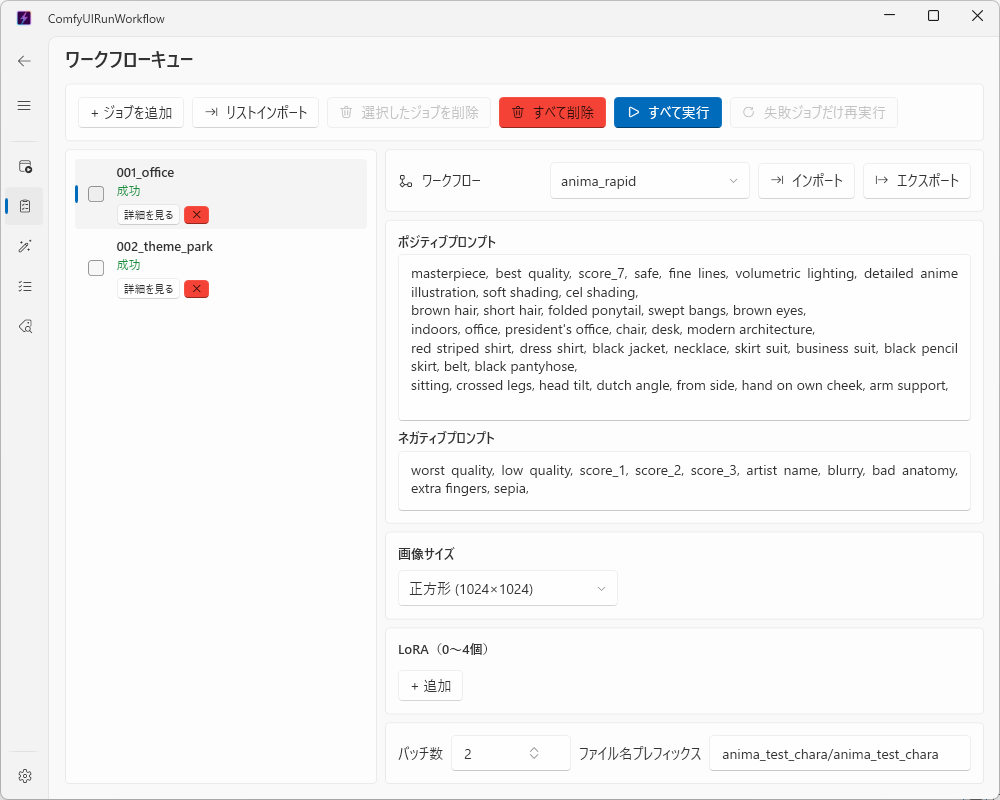

# Queue ページ（複数の画像をまとめて自動生成する）

✨ [English](queue_english.md)

[Home ページ](home.md) では1回に1つの内容しか生成できませんが、Queue ページでは「異なる内容の生成予約（ジョブ）」をいくつも登録しておいて、順番に自動で実行できます。

## 基本の使い方

1. 画面左上の **＋ ジョブを追加** をクリックして、ジョブ（生成予約）を追加します。必要な数だけ繰り返します。
2. 一覧からジョブを選ぶと、右側に Home ページと同じ入力項目（ワークフロー・プロンプト・画像サイズなど）が表示されるので、ジョブごとに内容を入力します。
3. 一覧のジョブ名（最初はワークフロー名が表示されています）をダブルクリックすると、分かりやすい名前に変更できます。
4. すべて入力できたら、画面上部の **すべて実行** をクリックすると、一覧の上から順番に自動で実行されます。

## 実行中の様子

- 現在実行中のジョブには「実行中」と表示され、進み具合も確認できます。
- 途中で **中断** をクリックすると、実行中のジョブが終わり次第、それ以降のジョブは実行されなくなります（実行中のジョブ自体は最後まで行われます）。
- あるジョブでエラーが起きても、そのジョブだけ「失敗」として記録され、次のジョブに進みます（全体は止まりません）。
- 一度「成功」したジョブがある状態で再度 **すべて実行** を押すと、成功済みのジョブは飛ばされ、まだ実行していないジョブや失敗したジョブだけが実行されます。

## ジョブの削除

- 各ジョブの右下にある **×** ボタンで1件ずつ削除できます。
- 一覧の左端のチェックボックスでまとめてチェックし、上部の **選択したジョブを削除** で複数まとめて削除できます。
- **すべて削除** で登録されている全ジョブを一度に削除できます。
- いずれも削除前に確認画面が表示されるので、間違って消してしまう心配はありません。

## 結果の確認

- 一覧の各ジョブにある **詳細を見る** ボタンから、そのジョブで生成された画像を確認できます（実行が終わったジョブのみ）。
- 生成された画像は [Data ページ](data.md) の「生成結果」タブからも確認できます。

## 設定を保存・呼び出す（インポート・エクスポート）

選んだジョブの右上にある **エクスポート** / **インポート** ボタンで、そのジョブ1件分の設定をファイルに保存したり、呼び出したりできます。使い方は [Home ページ](home.md) のインポート・エクスポートと同じです。

## 補足

- 登録したジョブの内容は、アプリを閉じても保存されており、次にアプリを開いたときも一覧に残っています。
- ただし「実行中」「成功」などの状態はアプリを再起動するとリセットされ、すべて「未実行」に戻ります（生成された画像自体は残っています）。
- [Generate ページ](generate.md) で一気に作ったジョブも、このページの **リストインポート** ボタンから取り込めます。
