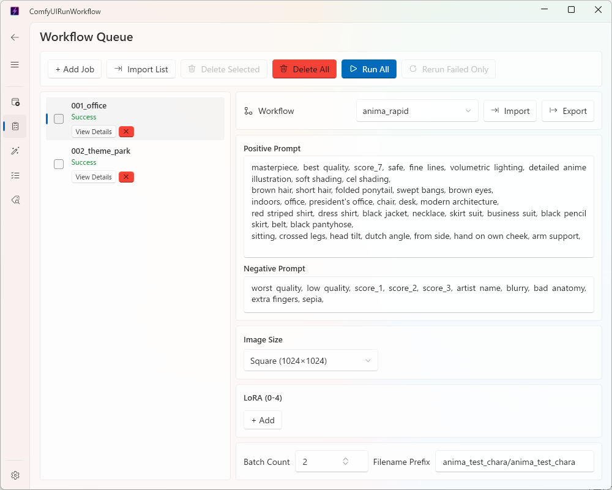

# Queue Page (Generating Several Images Automatically)

✨ [日本語](queue.md)

The [Home page](home_english.md) only lets you generate one thing at a time. The Queue page lets you register several different "jobs" in advance and run them all automatically, one after another.

## Basic Steps

1. Click **+ Add Job** at the top left to add a job. Repeat as many times as you need.
2. Select a job from the list, and the same fields as the Home page (workflow, prompts, image size, etc.) appear on the right — fill them in for each job.
3. Double-click a job's name in the list (it shows the workflow name by default) to give it a more descriptive name.
4. Once everything is filled in, click **Run All** at the top to execute every job one by one, from the top of the list down, regardless of status (jobs already marked "Success" are re-run too).

## While It's Running

- The job currently running is marked "Running", along with its progress.
- Clicking **Cancel** stops any further jobs from starting once the current one finishes (the job in progress still completes).
- If a job fails, it's marked "Failed" and the queue automatically moves on to the next job — the whole queue doesn't stop.
- **Run All** re-runs every job regardless of status, including ones already marked "Success". To leave successful jobs alone and only run the ones that haven't run yet (or failed), click **Rerun Failed Only** instead — jobs already marked "Success" are skipped.

## Deleting Jobs

- Click the **×** button at the bottom-right of a job to delete it by itself.
- Check the boxes on the left of the jobs you want to remove, then click **Delete Selected** to remove several at once.
- Click **Delete All** to remove every job in the list.
- Both bulk actions ask you to confirm before deleting anything, so there's no risk of removing jobs by accident.

## Checking Results

- Click **View Details** on any completed job to see the images it generated.
- Generated images also appear in the "Results" tab on the [Data page](data_english.md).

## Saving and Reloading a Job (Import / Export)

The **Export** / **Import** buttons at the top of the selected job's panel let you save that job's settings to a file, or load them back in. This works the same way as Import/Export on the [Home page](home_english.md).

## Good to Know

- The jobs you register are saved automatically and are still there the next time you open the app.
- However, statuses like "Running" or "Success" are not saved — after restarting the app, every job shows as "Pending" again (the generated images themselves are still safe).
- Jobs bulk-created on the [Generate page](generate_english.md) can also be brought in here via the **Import List** button.
