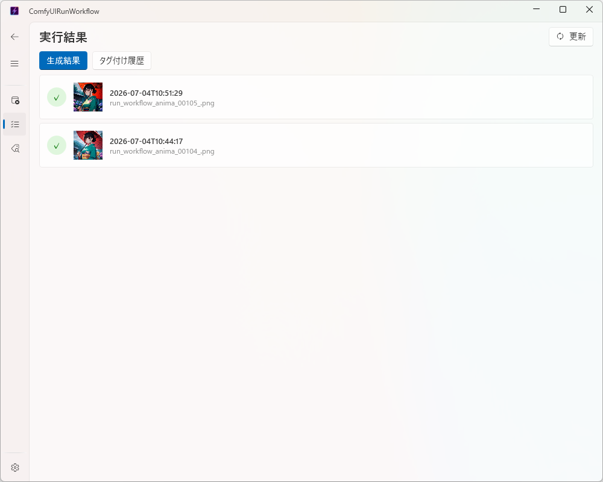
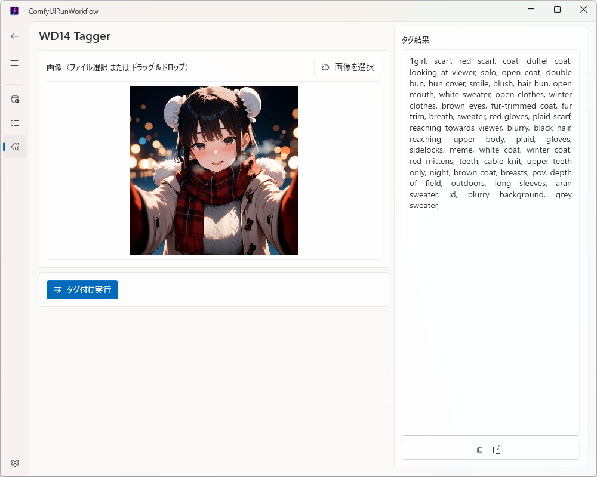

# 使い方

✨ [English](usage_english.md)

ComfyUIRunWorkflow の各ページの詳しい使い方をまとめたドキュメントです。
セットアップ手順は [README.md](../README.md) を参照してください。

## 目次

- [設定ページ](#設定ページ)
- [Home ページ（ワークフロー実行）](#home-ページワークフロー実行)
- [Data ページ（実行結果・タグ付け履歴）](#data-ページ実行結果タグ付け履歴)
- [Tagger ページ（WD14 Tagger）](#tagger-ページwd14-tagger)

---

## 設定ページ

アプリ起動後、最初に開いて以下を設定します。

| 項目 | 内容 |
|---|---|
| ComfyUI URL | ComfyUI サーバーの URL（デフォルト: `http://127.0.0.1:8188`） |
| workflow_config.json パス | ワークフロー定義・LoRA・WD14 Tagger 設定を記述した JSON ファイル |
| 結果出力フォルダ | 実行結果（`result_*.json`）・タグ付け履歴（`tag_result_*.json`）・プレビュー画像キャッシュ（`preview_cache/`）の保存先 |
| テーマ | ライト/ダークの切り替え |
| 言語 | 日本語/English の表示言語切替（既定: 日本語。切替は再起動不要で即時反映） |

設定内容はアプリ再起動後も保持されます。

---

## Home ページ（ワークフロー実行）

### 実行手順

1. ワークフロー（`sdxl` / `anima` / `anima_rapid` など、`workflow_config.json` の `workflows` に定義されたもの）を選択します
2. ポジティブ・ネガティブプロンプトを入力します
3. 画像サイズをプリセット（縦長・横長・正方形）またはカスタムで指定します
4. LoRA を追加します（任意、最大 4 個）
5. 必要に応じて **バッチ数**（1〜10、既定 1）を指定します
6. **実行** ボタンをクリックします

### バッチ数指定

バッチ数を 2 以上に指定すると、同じ内容（シードのみ自動更新）で指定回数分を順番に実行します。

- 実行中は「N/M件目を実行中」の進捗が ProgressBar 下に表示されます
- 全出力ファイルはまとめて 1 件の実行結果として保存されます
- 途中で ComfyUI 側のエラーが発生した場合は、その時点で中断し、それまでに成功した分だけをエラー付きの結果として保存します

### 実行結果プレビュー

実行が完了すると、生成された画像のサムネイルが右パネルに表示されます。サムネイルをクリックすると原寸で拡大表示されます。

---

## Data ページ（実行結果・タグ付け履歴）

ページ上部の「生成結果」「タグ付け履歴」タブで表示を切り替えます。

### 生成結果タブ

- 実行履歴（`結果出力フォルダ/result_*.json`）を新しい順に一覧表示します（サムネイル付き）
- 各行をクリックすると詳細ダイアログが開き、出力ファイルのサムネイル一覧を表示します
- サムネイルをクリックすると原寸で拡大表示します

サムネイルは ComfyUI の `GET /view` API から取得し、`結果出力フォルダ/preview_cache/` にキャッシュされます（同じ画像は 2 回目以降サーバーへ再アクセスしません）。

### タグ付け履歴タブ

- `結果出力フォルダ/tag_result_*.json` を新しい順に一覧表示します
- カードには入力ファイル名・タイムスタンプ・タグ全文・コピーボタンのみを表示します（サムネイルや詳細ダイアログはなく、カード上で完結します）

### 再読み込み

**更新** ボタンで両タブ分の一覧を再読み込みできます。

---

## Tagger ページ（WD14 Tagger）

画像 1 枚を選択して WD14 Tagger ワークフローを実行し、タグ文字列を取得・コピーできる専用ページです。

### 実行手順

1. 「画像を選択」ボタン、またはドラッグ＆ドロップで画像を指定するとプレビューが表示されます
2. **タグ付け実行** ボタンをクリックします
3. 右パネルにタグ（カンマ区切り）が表示されるので、**コピー** ボタンでクリップボードにコピーします

### モデル・しきい値について

モデル名・しきい値（general/character threshold）は `workflow_config.json` の `wd14_tagger` セクションの値が使用され、ページ上での変更はできません。変更したい場合は設定ページで `workflow_config.json` のパスを確認し、ファイル自体を編集します。

### 保存先

タグ付け結果は `結果出力フォルダ/tag_result_{timestamp}.json` に保存されます（ワークフロー実行結果 `result_*.json` とは別ファイルとして管理され、Data ページの「タグ付け履歴」タブに表示されます）。
