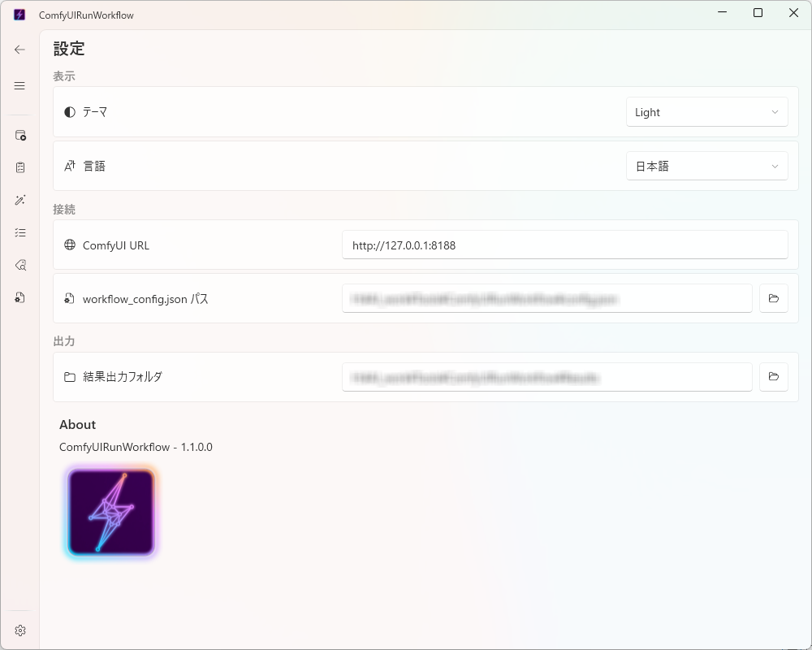
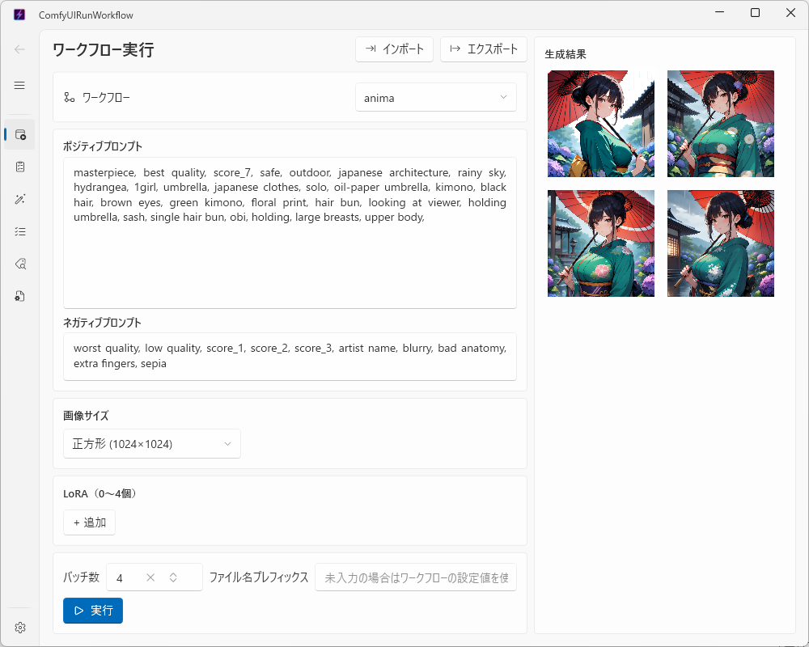
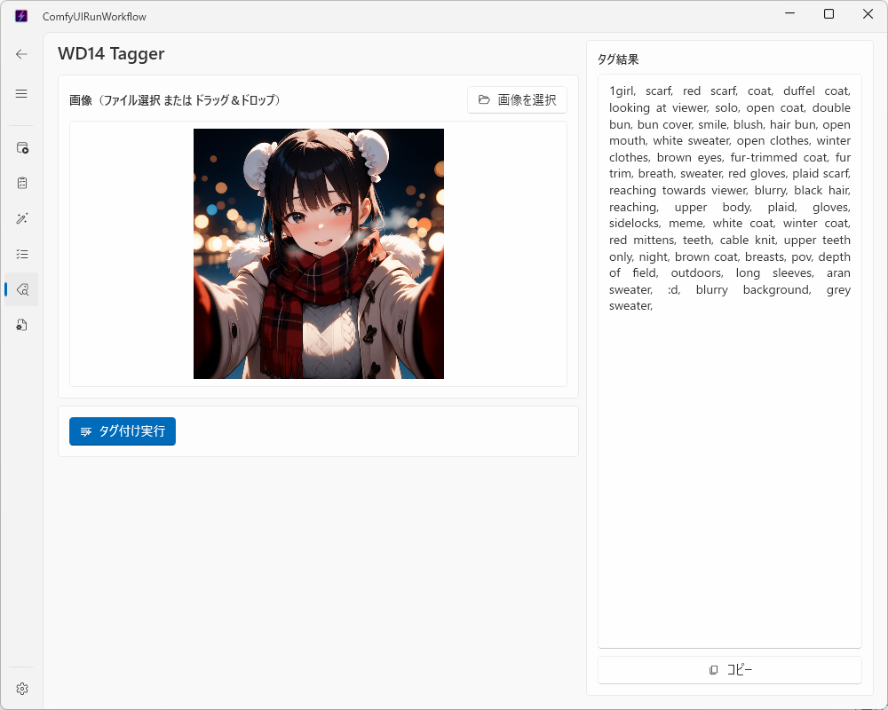

# 使い方

✨ [English](usage_english.md)

ComfyUIRunWorkflow の各ページの詳しい使い方をまとめたドキュメントです。
セットアップ手順は [README.md](../README.md) を参照してください。

## 目次

- [設定ページ](#設定ページ)
- [Home ページ（ワークフロー実行）](#home-ページワークフロー実行)
- [Queue ページ（複数ワークフロー連続実行）](#queue-ページ複数ワークフロー連続実行)
- [Data ページ（実行結果・タグ付け履歴）](#data-ページ実行結果タグ付け履歴)
- [Tagger ページ（WD14 Tagger）](#tagger-ページwd14-tagger)

---

## 設定ページ

アプリ起動後、最初に開いて以下を設定します。

| 項目 | 内容 |
|---|---|
| ComfyUI URL | ComfyUI サーバーの URL（デフォルト: `http://127.0.0.1:8188`） |
| workflow_config.json パス | ワークフロー定義・LoRA・WD14 Tagger 設定を記述した JSON ファイル |
| 結果出力フォルダ | 実行結果（`result_*.json`）・タグ付け履歴（`tag_result_*.json`）・プレビュー画像キャッシュ（`preview_cache/`）の保存先 |
| テーマ | ライト/ダークの切り替え |
| 言語 | 日本語/English の表示言語切替（既定: 日本語。切替は再起動不要で即時反映） |

設定内容はアプリ再起動後も保持されます。

### 表示言語の切替

- 選択肢: 「日本語」/「English」
- 反映範囲: 画面文言・メッセージ・ナビゲーションメニュー・トレイメニューなど GUI 全体
- 反映タイミング: 選択と同時に全画面へ即時反映（アプリの再起動は不要）
- 既定言語: 日本語（OS のロケール設定に関わらず、初回起動時は日本語）

---

## Home ページ（ワークフロー実行）

### 実行手順

1. ワークフロー（`sdxl` / `anima` / `anima_rapid` など、`workflow_config.json` の `workflows` に定義されたもの）を選択します
2. ポジティブ・ネガティブプロンプトを入力します
3. 画像サイズをプリセット（縦長・横長・正方形）またはカスタムで指定します
4. LoRA を追加します（任意、最大 4 個）
5. 必要に応じて **ファイル名プレフィックス** を指定します（任意。空欄の場合はワークフローに記述された値をそのまま使用します）
6. 必要に応じて **バッチ数**（1〜10、既定 1）を指定します
7. **実行** ボタンをクリックします

### ファイル名プレフィックス

生成される画像ファイル名の先頭部分（ComfyUI の `SaveImage` ノードの `filename_prefix`）を指定できます。空欄のまま実行した場合は、選択中のワークフローテンプレートに記述されているプレフィックスがそのまま使用されます。

### バッチ数指定

バッチ数を 2 以上に指定すると、同じ内容（シードのみ自動更新）で指定回数分を順番に実行します。

- 実行中は「N/M件目を実行中」の進捗が ProgressBar 下に表示されます
- 全出力ファイルはまとめて 1 件の実行結果として保存されます
- 途中で ComfyUI 側のエラーが発生した場合は、その時点で中断し、それまでに成功した分だけをエラー付きの結果として保存します

### 実行結果プレビュー

実行が完了すると、生成された画像のサムネイルが右パネルに表示されます。サムネイルをクリックすると原寸で拡大表示されます。

### 設定のインポート・エクスポート

タイトル右の **インポート** / **エクスポート** ボタンから、Home ページの設定内容を JSON ファイルとして保存・読み込みできます。

- 対象項目: ワークフロー・ポジティブ/ネガティブプロンプト・画像サイズ（プリセット/カスタム）・LoRA・バッチ数・ファイル名プレフィックス
- **エクスポート**: 現在フォームに入力されている内容を JSON ファイルに保存します
- **インポート**: JSON ファイルを読み込み、フォームの内容を一括で置き換えます
  - ワークフロー名が、現在読み込まれている `workflow_config.json` に存在しない場合は、ワークフロー選択のみ変更せず、それ以外の項目（プロンプト・画像サイズ・LoRA・バッチ数・ファイル名プレフィックス）を反映します
- JSON の形式は Queue ページの各ジョブのインポート・エクスポート（後述）と共通のスキーマです。Home ページでエクスポートした設定を Queue ページのジョブとしてインポートする、といった使い方もできます
- ワークフロー実行中はインポート・エクスポートともに操作できません

---

## Queue ページ（複数ワークフロー連続実行）

ワークフロー・プロンプト・LoRA・画像サイズ・ファイル名プレフィックス・バッチ数の組を「ジョブ」としてリストに複数登録し、上から順番に自動実行できるページです。異なるワークフロー（例: `sdxl` と `anima`）を1回の操作でまとめて実行したい場合に使用します。

### 使い方

1. 「+ ジョブを追加」でジョブをリストに追加します（必要な数だけ繰り返します）
2. 一覧からジョブを選択すると、右側の編集パネルでそのジョブの内容（ワークフロー・プロンプト・画像サイズ・LoRA・ファイル名プレフィックス・バッチ数）を編集できます。各ジョブは Home ページと同様に個別に設定できます（ファイル名プレフィックスも空欄の場合はワークフローの値をそのまま使用します）
3. 「すべて実行」をクリックすると、リストの先頭から順に1件ずつ実行されます

### ジョブ設定のインポート・エクスポート

編集パネル右上の **インポート** / **エクスポート** ボタンから、選択中のジョブ1件分の設定を JSON ファイルとして保存・読み込みできます。挙動は Home ページのインポート・エクスポート（前述）と同じです。

- 対象項目: ワークフロー・ポジティブ/ネガティブプロンプト・画像サイズ（プリセット/カスタム）・LoRA・バッチ数・ファイル名プレフィックス
- ワークフロー名が現在読み込まれている `workflow_config.json` に存在しない場合は、ワークフロー選択のみ変更せず、それ以外の項目を反映します
- インポートした内容は `queue_jobs.json` へ即座に保存されます
- キュー全体の実行中（「すべて実行」中）は編集パネル自体が無効化されるため、インポート・エクスポートも操作できません

### ステータス表示

各ジョブには実行状態が表示されます。

| ステータス | 意味 |
|---|---|
| 未実行 | まだ実行されていない |
| 実行中 | 現在実行中（バッチ実行中の進捗も表示されます） |
| 成功 | 実行が成功した |
| 失敗 | ComfyUI 側でエラーが発生した |
| 中断 | 「中断」操作により、着手されないままスキップされた |

### エラー時・中断時の挙動

- あるジョブで ComfyUI 側のエラーが発生した場合、そのジョブは「失敗」として記録され、次のジョブの実行に自動的に進みます（キュー全体は止まりません）
- 実行中に「中断」ボタンをクリックすると、現在実行中のジョブが完了した時点で以降のジョブへの着手を止めます（実行中のジョブ自体は最後まで完了します）
- 既に「成功」しているジョブがある状態で再度「すべて実行」をクリックすると、成功済みのジョブはスキップされ、未実行・失敗・中断のジョブのみが実行されます（失敗したジョブだけをやり直したい場合に、そのまま「すべて実行」を押せば再実行できます）

### 実行結果の確認・保存

- 各ジョブの実行結果は、Home ページでの実行と同様に `結果出力フォルダ/result_*.json` として個別に保存され、Data ページの「生成結果」タブにもそのまま表示されます
- 一覧の各ジョブにある「詳細を見る」ボタンから、そのジョブの実行結果詳細ダイアログ（出力ファイルのサムネイル一覧・拡大表示）を確認できます（実行結果がある場合のみ有効）

### ジョブリストの保持

登録したジョブの内容（ワークフロー・プロンプト・LoRA・画像サイズ・ファイル名プレフィックス・バッチ数）は、アプリのカレントディレクトリ直下の `queue_jobs.json` に保存され、再起動後も保持されます（`ComfyUIRunWorkflow_setting.json` とは別ファイルです）。`queue_jobs.json` が存在しない場合、ワークフローキューは空のリストから始まります。ただし実行ステータス・実行結果はセッション限りのため、再起動後は全ジョブが「未実行」から始まります（実行結果自体は `result_*.json` として残っています）。

---

## Data ページ（実行結果・タグ付け履歴）

ページ上部の「生成結果」「タグ付け履歴」タブで表示を切り替えます。

### 生成結果タブ

- 実行履歴（`結果出力フォルダ/result_*.json`）を新しい順に一覧表示します（サムネイル付き）
- 各行をクリックすると詳細ダイアログが開き、出力ファイルのサムネイル一覧を表示します
- サムネイルをクリックすると原寸で拡大表示します

サムネイルは ComfyUI の `GET /view` API から取得し、`結果出力フォルダ/preview_cache/` にキャッシュされます（同じ画像は 2 回目以降サーバーへ再アクセスしません）。

### タグ付け履歴タブ

- `結果出力フォルダ/tag_result_*.json` を新しい順に一覧表示します
- カードには入力ファイル名・タイムスタンプ・タグ全文・コピーボタンのみを表示します（サムネイルや詳細ダイアログはなく、カード上で完結します）

### 再読み込み

**更新** ボタンで両タブ分の一覧を再読み込みできます。

---

## Tagger ページ（WD14 Tagger）

画像 1 枚を選択して WD14 Tagger ワークフローを実行し、タグ文字列を取得・コピーできる専用ページです。

### 実行手順

1. 「画像を選択」ボタン、またはドラッグ＆ドロップで画像を指定するとプレビューが表示されます
2. **タグ付け実行** ボタンをクリックします
3. 右パネルにタグ（カンマ区切り）が表示されるので、**コピー** ボタンでクリップボードにコピーします

### モデル・しきい値について

モデル名・しきい値（general/character threshold）は `workflow_config.json` の `wd14_tagger` セクションの値が使用され、ページ上での変更はできません。変更したい場合は設定ページで `workflow_config.json` のパスを確認し、ファイル自体を編集します。

### 保存先

タグ付け結果は `結果出力フォルダ/tag_result_{timestamp}.json` に保存されます（ワークフロー実行結果 `result_*.json` とは別ファイルとして管理され、Data ページの「タグ付け履歴」タブに表示されます）。
