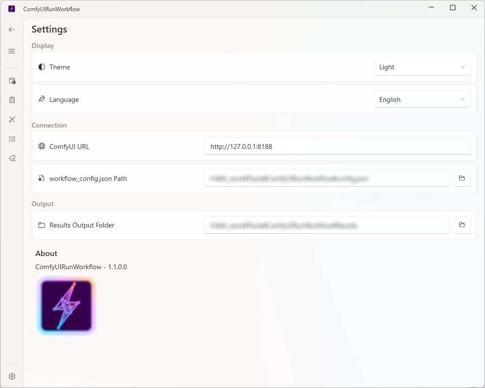
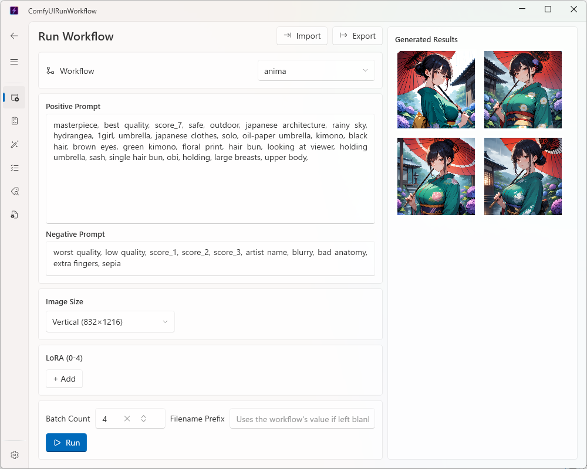
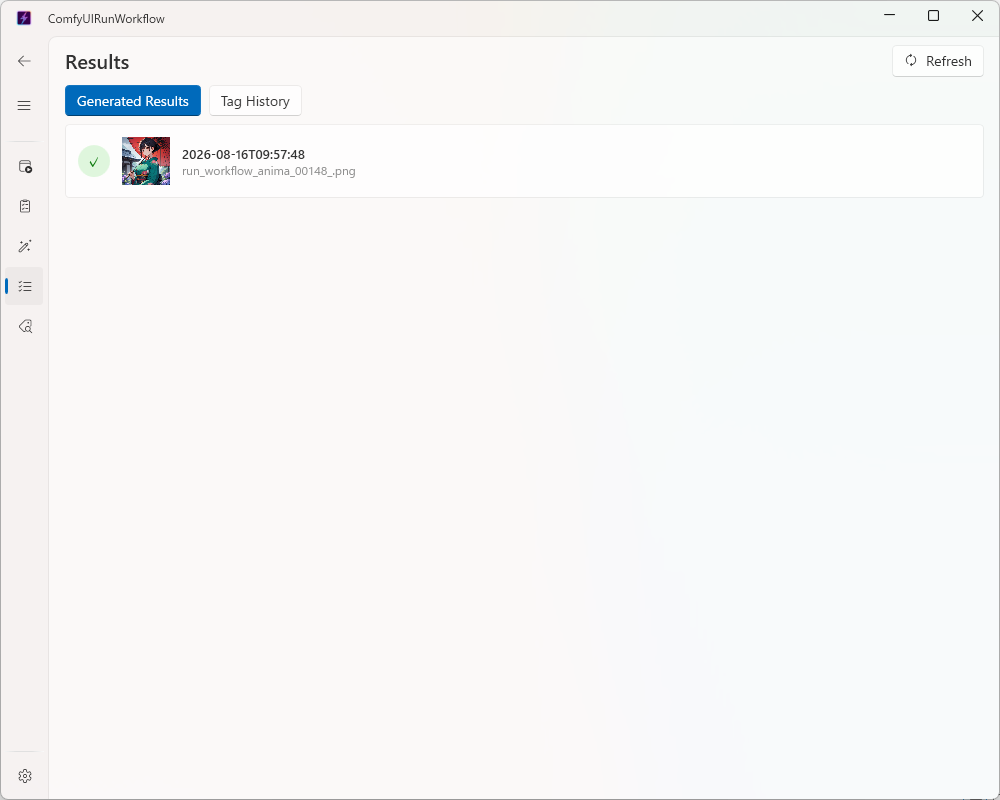
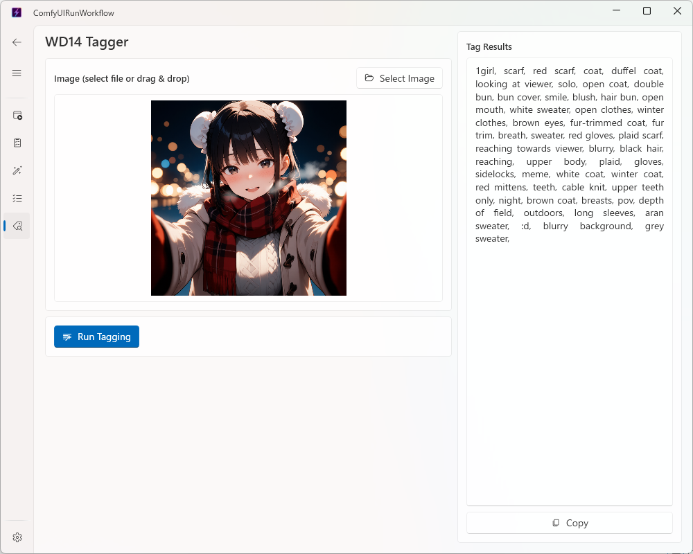

# Usage

✨ [日本語](usage.md)

A detailed guide to each page of ComfyUIRunWorkflow.
For setup instructions, see the [Quick Start](README_english.md) section of the English README.

## Table of Contents

- [Settings Page](#settings-page)
- [Home Page (Running Workflows)](#home-page-running-workflows)
- [Queue Page (Running Multiple Workflows in Sequence)](#queue-page-running-multiple-workflows-in-sequence)
- [Data Page (Results / Tag History)](#data-page-results--tag-history)
- [Tagger Page (WD14 Tagger)](#tagger-page-wd14-tagger)

---

## Settings Page

Open this page first after launching the app and configure the following.

| Item | Description |
|---|---|
| ComfyUI URL | The ComfyUI server URL (default: `http://127.0.0.1:8188`) |
| workflow_config.json path | The JSON file defining workflows, LoRA, and WD14 Tagger settings |
| Results folder | Where execution results (`result_*.json`), tag history (`tag_result_*.json`), and the preview image cache (`preview_cache/`) are stored |
| Theme | Switch between light and dark |
| Language | Switch the display language between Japanese and English (default: Japanese; applies immediately, no restart required) |

Settings persist across app restarts.

### Switching the Display Language

- Options: "日本語" / "English"
- Scope: the entire GUI — screen text, messages, navigation menu, tray menu, etc.
- When it applies: instantly across every screen as soon as you select it (no app restart required)
- Default language: Japanese (always Japanese on first launch, regardless of the OS locale)

---

## Home Page (Running Workflows)

### Steps

1. Select a workflow (`sdxl`, `anima`, `anima_rapid`, etc. — as defined under `workflows` in `workflow_config.json`)
2. Enter the positive and negative prompts
3. Choose an image size — a preset (vertical / horizontal / square) or a custom size
4. Add LoRAs (optional, up to 4)
5. Set the **filename prefix** if needed (optional — if left blank, the value written in the workflow is used as-is)
6. Set the **batch count** if needed (1–10, default 1)
7. Click **Run**

### Filename Prefix

You can override the beginning of the generated image filenames (the `filename_prefix` on ComfyUI's `SaveImage` node). If left blank when running, the prefix already written in the selected workflow template is used as-is.

### Batch Count

Setting the batch count to 2 or more runs the same content (only the seed is auto-incremented) that many times in sequence.

- Progress ("Running N/M") is shown below the progress bar while running
- All output files are combined and saved as a single execution result
- If a ComfyUI error occurs partway through, execution stops at that point and the outputs succeeded so far are saved as a result with an error

### Result Preview

Once execution finishes, thumbnails of the generated images appear in the right panel. Click a thumbnail to view it at full size.

---

## Queue Page (Running Multiple Workflows in Sequence)

This page lets you register multiple "jobs" — each a combination of workflow, prompts, LoRA, image size, filename prefix, and batch count — in a list, and run them automatically one after another from the top. Use it when you want to run several workflows (e.g. `sdxl` and `anima`) together in one operation.

### Steps

1. Click "+ Add Job" to add a job to the list (repeat as many times as needed)
2. Selecting a job in the list lets you edit its content (workflow, prompts, image size, LoRA, filename prefix, batch count) in the panel on the right, just like on the Home page — each job can be configured independently (an empty filename prefix uses the workflow's value, same as on the Home page)
3. Click **Run All** to execute the jobs one by one, starting from the top of the list

### Status Display

Each job shows its current execution status.

| Status | Meaning |
|---|---|
| Pending | Not yet run |
| Running | Currently running (batch progress is also shown) |
| Success | Ran successfully |
| Failed | A ComfyUI-side error occurred |
| Cancelled | Skipped without starting, due to a "Cancel" operation |

### Error and Cancellation Behavior

- If a ComfyUI error occurs for a job, that job is recorded as "Failed" and execution automatically continues with the next job (the whole queue does not stop)
- Clicking **Cancel** while running stops further jobs from starting once the currently running job finishes (the job in progress still runs to completion)
- If you click **Run All** again while some jobs are already "Success", those are skipped and only pending/failed/cancelled jobs are run — so you can simply click **Run All** again to retry just the jobs that failed

### Viewing and Saving Results

- Each job's result is saved individually as `{results folder}/result_*.json`, just like a Home page run, and also appears in the "Results" tab on the Data page
- The **View Details** button on each job (enabled only once that job has a result) opens the same result detail dialog used elsewhere — a thumbnail list of output files with click-to-enlarge

### Job List Persistence

The job definitions (workflow, prompts, LoRA, image size, filename prefix, batch count) are saved to `queue_jobs.json` in the app's current directory and persist across restarts (a separate file from `ComfyUIRunWorkflow_setting.json`). If `queue_jobs.json` doesn't exist, the workflow queue starts as an empty list. Execution status and results, however, are session-only — after restarting, every job starts over as "Pending" (the results themselves remain available as `result_*.json` files).

---

## Data Page (Results / Tag History)

Switch views using the "Results" / "Tag History" tabs at the top of the page.

### Results Tab

- Lists execution history (`{results folder}/result_*.json`) newest first, with thumbnails
- Clicking a row opens a detail dialog showing thumbnails of all output files
- Click a thumbnail to view it at full size

Thumbnails are fetched via ComfyUI's `GET /view` API and cached under `{results folder}/preview_cache/` (the same image is not re-fetched from the server after the first time).

### Tag History Tab

- Lists `{results folder}/tag_result_*.json` newest first
- Each card shows only the input filename, timestamp, full tag text, and a copy button (no thumbnail or detail dialog — everything is self-contained in the card)

### Refresh

The **Refresh** button reloads both tabs.

---

## Tagger Page (WD14 Tagger)

A dedicated page for selecting a single image, running the WD14 Tagger workflow, and getting/copying the resulting tag string.

### Steps

1. Select an image via the "Select Image" button or by dragging and dropping it — a preview appears
2. Click **Run Tagging**
3. The tags (comma-separated) appear in the right panel; click **Copy** to copy them to the clipboard

### Model and Thresholds

The model name and thresholds (general/character threshold) come from the `wd14_tagger` section of `workflow_config.json` and cannot be changed from the page. To change them, check the `workflow_config.json` path on the Settings page and edit the file directly.

### Where Results Are Saved

Tagging results are saved to `{results folder}/tag_result_{timestamp}.json` (managed separately from workflow execution results `result_*.json`, and shown in the "Tag History" tab on the Data page).
