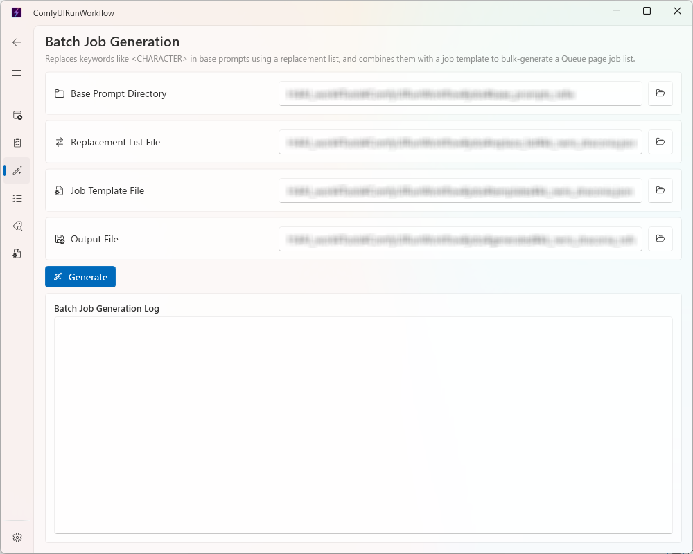

# Usage

✨ [日本語](usage.md)

A detailed guide to each page of ComfyUIRunWorkflow.
For setup instructions, see the [Quick Start](README_english.md) section of the English README.

## Table of Contents

- [Settings Page](#settings-page)
- [Home Page (Running Workflows)](#home-page-running-workflows)
- [Queue Page (Running Multiple Workflows in Sequence)](#queue-page-running-multiple-workflows-in-sequence)
- [Generate Page (Batch Job Generation)](#generate-page-batch-job-generation)
- [Data Page (Results / Tag History)](#data-page-results--tag-history)
- [Tagger Page (WD14 Tagger)](#tagger-page-wd14-tagger)

---

## Settings Page

Open this page first after launching the app and configure the following.

| Item | Description |
|---|---|
| ComfyUI URL | The ComfyUI server URL (default: `http://127.0.0.1:8188`) |
| workflow_config.json path | The JSON file defining workflows, LoRA, and WD14 Tagger settings |
| Results folder | Where execution results (`result_*.json`), tag history (`tag_result_*.json`), and the preview image cache (`preview_cache/`) are stored |
| Theme | Switch between light and dark |
| Language | Switch the display language between Japanese and English (default: Japanese; applies immediately, no restart required) |

Settings persist across app restarts.

### Switching the Display Language

- Options: "日本語" / "English"
- Scope: the entire GUI — screen text, messages, navigation menu, tray menu, etc.
- When it applies: instantly across every screen as soon as you select it (no app restart required)
- Default language: Japanese (always Japanese on first launch, regardless of the OS locale)

---

## Home Page (Running Workflows)

### Steps

1. Select a workflow (`sdxl`, `anima`, `anima_rapid`, etc. — as defined under `workflows` in `workflow_config.json`)
2. Enter the positive and negative prompts
3. Choose an image size — a preset (vertical / horizontal / square) or a custom size
4. Add LoRAs (optional, up to 4)
5. Set the **filename prefix** if needed (optional — if left blank, the value written in the workflow is used as-is)
6. Set the **batch count** if needed (1–10, default 1)
7. Click **Run**

### Filename Prefix

You can override the beginning of the generated image filenames (the `filename_prefix` on ComfyUI's `SaveImage` node). If left blank when running, the prefix already written in the selected workflow template is used as-is.

### Batch Count

Setting the batch count to 2 or more runs the same content (only the seed is auto-incremented) that many times in sequence.

- Progress ("Running N/M") is shown below the progress bar while running
- All output files are combined and saved as a single execution result
- If a ComfyUI error occurs partway through, execution stops at that point and the outputs succeeded so far are saved as a result with an error

### Result Preview

Once execution finishes, thumbnails of the generated images appear in the right panel. Click a thumbnail to view it at full size.

### Import / Export Settings

The **Import** / **Export** buttons next to the title let you save and load the Home page's settings as a JSON file.

- Fields covered: workflow, positive/negative prompt, image size (preset/custom), LoRA, batch count, filename prefix
- **Export**: saves the values currently entered in the form to a JSON file
- **Import**: loads a JSON file and replaces the form's contents in one step
  - If the workflow name isn't present in the currently loaded `workflow_config.json`, the workflow selection is left unchanged while every other field (prompts, image size, LoRA, batch count, filename prefix) is still applied
- The JSON uses the same schema as importing/exporting a single job on the Queue page (see below). You can, for example, export settings from the Home page and import them as a job on the Queue page
- Import and export are both disabled while a workflow is running

---

## Queue Page (Running Multiple Workflows in Sequence)

This page lets you register multiple "jobs" — each a combination of workflow, prompts, LoRA, image size, filename prefix, and batch count — in a list, and run them automatically one after another from the top. Use it when you want to run several workflows (e.g. `sdxl` and `anima`) together in one operation.

### Job Name

Each job in the list shows a "job name". If it hasn't been set, the workflow name is shown instead. Double-click a job's name in the list to edit it in place — press Enter or click elsewhere to commit the change. Job names are saved to `queue_jobs.json` and persist across restarts.

### Steps

1. Click "+ Add Job" to add a job to the list (repeat as many times as needed)
2. Selecting a job in the list lets you edit its content (workflow, prompts, image size, LoRA, filename prefix, batch count) in the panel on the right, just like on the Home page — each job can be configured independently (an empty filename prefix uses the workflow's value, same as on the Home page)
3. Double-click a job's name in the list to give it a descriptive name so it's easier to tell jobs apart later (optional)
4. Click **Run All** to execute the jobs one by one, starting from the top of the list

### Deleting Jobs

Use the × button at the bottom-right of each job to delete it individually. Once the list grows large, you can also delete jobs in bulk from the toolbar:

- **Delete Selected**: Check the checkbox on the left of each job you want to remove, then click this button. It is disabled when no job is checked.
- **Delete All**: Deletes every registered job at once.

Both actions show a confirmation dialog first; jobs are only deleted if you choose "Delete" (this cannot be undone). The deletion is immediately reflected in `queue_jobs.json`. Both buttons are disabled while the queue is running ("Run All" in progress).

### Import / Export Job Settings

The **Import** / **Export** buttons at the top of the edit panel let you save and load the selected job's settings as a JSON file. The behavior is the same as Import/Export on the Home page (see above).

- Fields covered: job name, workflow, positive/negative prompt, image size (preset/custom), LoRA, batch count, filename prefix
- If the workflow name isn't present in the currently loaded `workflow_config.json`, the workflow selection is left unchanged while every other field is still applied
- Imported changes are saved to `queue_jobs.json` immediately
- The edit panel itself is disabled while the queue is running (**Run All** in progress), so import/export are unavailable then too

### Status Display

Each job shows its current execution status.

| Status | Meaning |
|---|---|
| Pending | Not yet run |
| Running | Currently running (batch progress is also shown) |
| Success | Ran successfully |
| Failed | A ComfyUI-side error occurred |
| Cancelled | Skipped without starting, due to a "Cancel" operation |

### Error and Cancellation Behavior

- If a ComfyUI error occurs for a job, that job is recorded as "Failed" and execution automatically continues with the next job (the whole queue does not stop)
- Clicking **Cancel** while running stops further jobs from starting once the currently running job finishes (the job in progress still runs to completion)
- If you click **Run All** again while some jobs are already "Success", those are skipped and only pending/failed/cancelled jobs are run — so you can simply click **Run All** again to retry just the jobs that failed

### Viewing and Saving Results

- Each job's result is saved individually as `{results folder}/result_*.json`, just like a Home page run, and also appears in the "Results" tab on the Data page
- The **View Details** button on each job (enabled only once that job has a result) opens the same result detail dialog used elsewhere — a thumbnail list of output files with click-to-enlarge

### Job List Persistence

The job definitions (workflow, prompts, LoRA, image size, filename prefix, batch count) are saved to `queue_jobs.json` in the app's current directory and persist across restarts (a separate file from `ComfyUIRunWorkflow_setting.json`). If `queue_jobs.json` doesn't exist, the workflow queue starts as an empty list. Execution status and results, however, are session-only — after restarting, every job starts over as "Pending" (the results themselves remain available as `result_*.json` files).

---

## Generate Page (Batch Job Generation)

This page replaces keywords like `<CHARACTER>` in base prompts (JSON files with `positive`/`negative` keys) using a replacement list, then combines the result with a job template to bulk-generate a job list for the Queue page. It saves you from registering, by hand, a large number of jobs that only differ by character or outfit while sharing the same composition and settings.

### Input File Formats

| Input | Format | Description |
|---|---|---|
| Base prompt directory | A directory containing multiple `*.json` files | Each file has the form `{"positive": "...", "negative": "..."}`. Every `*.json` directly under the directory is processed as one job |
| Replacement list file | JSON (keyword → replacement string dictionary) | E.g. `{"<CHARACTER>": "alice, blonde hair", "<OUTFIT>": "school uniform"}` — maps each placeholder used in base prompts to its replacement text |
| Job template file | JSON (the `QueueJobData` format minus the two prompt fields) | The settings shared by every generated job — workflow, LoRA, image size, batch count, filename prefix, etc. A JSON file exported from the Queue page with the prompt fields cleared can be used as-is |

### Steps

1. Specify the **base prompt directory**, **replacement list file**, **job template file**, and **output file** using the "Browse" buttons for each (the **Generate** button becomes enabled once all four are set)
2. Click **Generate**
3. One job is generated per base prompt file, and the result is written to the output file in the same format as `queue_jobs.json` (`QueueJobListData`). Each generated job's name is set automatically to its base prompt's filename (without extension), so it's easy to tell which base prompt produced which job in the Queue page's list

The generated jobs can be brought into the Queue page's current job list via the **Import List** button.

### Placeholder Replacement

- For both the `positive` and `negative` fields of each base prompt, `<...>`-style keywords are replaced with the corresponding value from the replacement list
- If a base prompt contains a keyword that isn't in the replacement list, the entire generation is aborted with an error message identifying the file and the missing keyword. No output file is written in that case, so you never end up with a partially-replaced job list
- Replacement list entries that aren't used by any base prompt are simply ignored

### Generation Log

The log area below the **Generate** button shows, line by line, the result of loading the template and replacement list, how many base prompt files were found, the job generation status for each file, and the result of writing the output file. If an error occurs, its details are shown here as well. The log is cleared each time you click **Generate**.

### Input Path Persistence

The four input paths (base prompt directory, replacement list file, job template file, output file) are saved as settings and restored the next time you open this page.

### Sample Files

[`sample_jobs/`](../sample_jobs) at the repository root contains samples that map directly to the Generate page's four inputs (automatically copied next to the executable at build time). Point each field at these files to see the actual input/output format in action.

| Directory / File | Corresponds to | Contents |
|---|---|---|
| `sample_jobs/base_prompts/` | Base prompt directory | `001_office.json` / `002_theme_park.json` — example prompts containing placeholders such as `<character>` and `<outfit_01_cowboy_shot>` |
| `sample_jobs/replace_list/test_chara.json` | Replacement list file | Example replacement strings for the placeholders above |
| `sample_jobs/job_templates/test_chara_job_template.json` | Job template file | Example shared settings (workflow, image size, batch count, filename prefix, etc.); both prompt fields are left empty |
| `sample_jobs/generated/test_chara_jobs.json` | Output file | The actual output generated from the three inputs above (`QueueJobListData` format). You can bring it into the Queue page as-is via the **Import List** button to see it in action |

---

## Data Page (Results / Tag History)

Switch views using the "Results" / "Tag History" tabs at the top of the page.

### Results Tab

- Lists execution history (`{results folder}/result_*.json`) newest first, with thumbnails
- Clicking a row opens a detail dialog showing thumbnails of all output files
- Click a thumbnail to view it at full size

Thumbnails are fetched via ComfyUI's `GET /view` API and cached under `{results folder}/preview_cache/` (the same image is not re-fetched from the server after the first time).

### Tag History Tab

- Lists `{results folder}/tag_result_*.json` newest first
- Each card shows only the input filename, timestamp, full tag text, and a copy button (no thumbnail or detail dialog — everything is self-contained in the card)

### Refresh

The **Refresh** button reloads both tabs.

---

## Tagger Page (WD14 Tagger)

A dedicated page for selecting a single image, running the WD14 Tagger workflow, and getting/copying the resulting tag string.

### Steps

1. Select an image via the "Select Image" button or by dragging and dropping it — a preview appears
2. Click **Run Tagging**
3. The tags (comma-separated) appear in the right panel; click **Copy** to copy them to the clipboard

### Model and Thresholds

The model name and thresholds (general/character threshold) come from the `wd14_tagger` section of `workflow_config.json` and cannot be changed from the page. To change them, check the `workflow_config.json` path on the Settings page and edit the file directly.

### Where Results Are Saved

Tagging results are saved to `{results folder}/tag_result_{timestamp}.json` (managed separately from workflow execution results `result_*.json`, and shown in the "Tag History" tab on the Data page).
